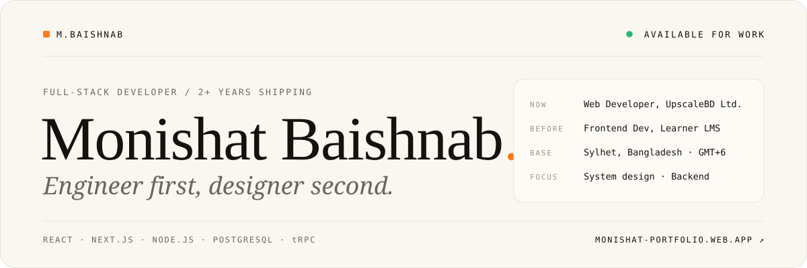
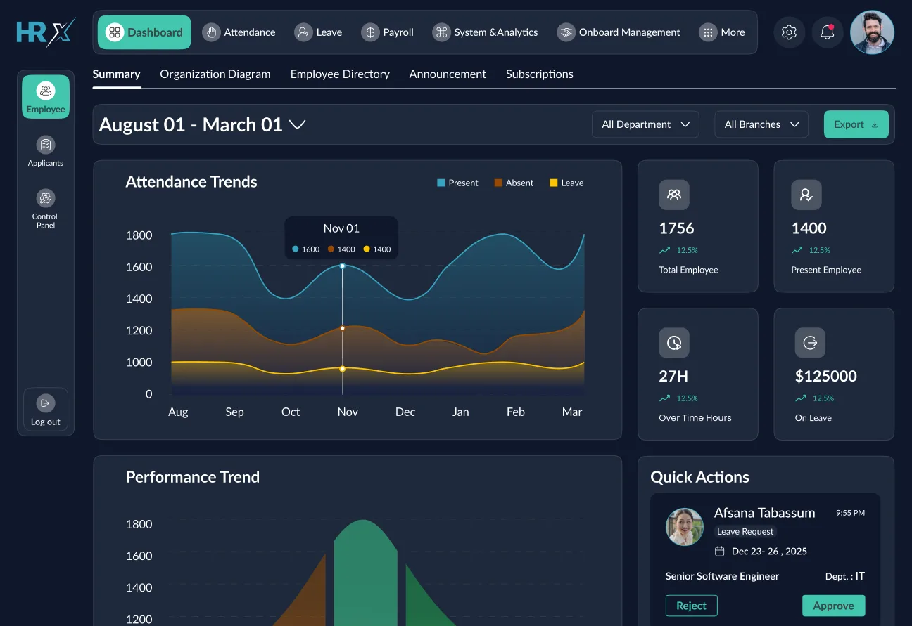
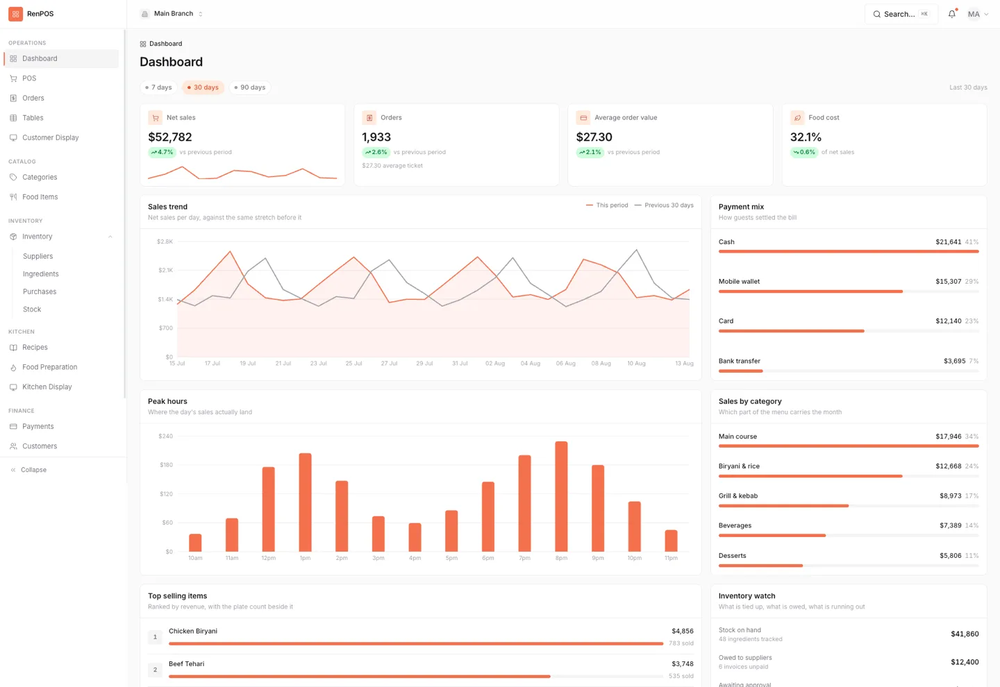

  <a href="https://monishat-portfolio.web.app/">
    <picture>
      <source media="(prefers-color-scheme: dark)" srcset="./assets/banner-dark.svg" />
      
    </picture>
  </a>

  
  
  
  

 

## 01 · About

I build full-stack web products with modern JavaScript — most often **React** and **Next.js** on the front, **Node**, **PostgreSQL** and **MongoDB** behind it. Right now I'm a Web Developer at **UpscaleBD Ltd.**, where I build multi-tenant SaaS products and maintain the component library and frontend standards the team works from.

> _Engineer first, designer second._ I care about the details — how a button feels, how a page loads, how the codebase reads two years from now.

- **Currently focused on** system design, backend development, database design and tRPC
- **Based in** Sylhet, Bangladesh · GMT+6
- **Open to** full-time roles, and project-based work alongside them

 

## 02 · Experience

**Web Developer** · [UpscaleBD Ltd.](https://upscalebd.com) &nbsp;JUN 2025 — PRESENT · DHAKA 
I build management software and company websites end to end, set the coding standards and component library the team works from, and mentor teammates along the way.

**Frontend Developer** · Learner LMS &nbsp;MAR 2024 — MAY 2025 · SYLHET 
I built the course and payment management interfaces for a learning platform, with reusable UI components that improved interaction quality by an estimated 20–30%.

 

## 03 · Case studies

<table>
  <tr>
    <td width="50%" valign="top">
      
      <h3>HRX</h3>
      <b>MULTI-TENANT HR SAAS</b> · UpscaleBD · Aug 2025 – Apr 2026
      
An HR platform that organisations sign up for, pick a plan, and use to run the whole employee lifecycle — recruitment, attendance, leave, payroll and performance — from one dashboard. A single route config drives the router, the sidebar and every role and plan gate.

      
<b>273</b> API endpoints &nbsp;·&nbsp; <b>20</b> modules &nbsp;·&nbsp; <b>268</b> of 495 commits

      
<code>React 19</code> <code>RTK Query</code> <code>Ant Design</code>

      <a href="https://monishat-portfolio.web.app/case-studies/hrx"><b>Read the case study →</b></a>
    </td>
    <td width="50%" valign="top">
      
      <h3>Renpos</h3>
      <b>MULTI-TENANT RESTAURANT POS</b> · Full-stack · Jun 2026 – ongoing
      
A point-of-sale platform covering counter and table ordering, kitchen displays, ingredient-level inventory and supplier purchasing. Every restaurant gets its own Postgres database, so the database enforces tenant isolation instead of application code.

      
<b>40</b> tables &nbsp;·&nbsp; <b>53</b> permission keys &nbsp;·&nbsp; <b>22</b> modules

      
<code>Next.js 16</code> <code>Express</code> <code>tRPC</code> <code>PostgreSQL</code> <code>Drizzle</code>

      <a href="https://monishat-portfolio.web.app/case-studies/renpos"><b>Read the case study →</b></a>
    </td>
  </tr>
</table>

 

 

## 04 · Tech stack

<table>
  <tr>
    <td width="150"><b>Frontend</b></td>
    <td>
      <picture>
        <source media="(prefers-color-scheme: dark)" srcset="https://skillicons.dev/icons?i=react%2Cnextjs%2Cts%2Cjs%2Ctailwind%2Credux&theme=dark" />
        
      </picture>
       shadcn/ui · Ant Design · HeroUI · Zustand · TanStack Query · React Hook Form · Zod · Framer Motion
    </td>
  </tr>
  <tr>
    <td><b>Backend &amp; data</b></td>
    <td>
      <picture>
        <source media="(prefers-color-scheme: dark)" srcset="https://skillicons.dev/icons?i=nodejs%2Cexpress%2Cpostgres%2Cprisma%2Cmongodb%2Cgraphql%2Credis&theme=dark" />
        
      </picture>
       tRPC · Drizzle · Mongoose · Better Auth · Stripe · Resend
    </td>
  </tr>
  <tr>
    <td><b>Tools &amp; DevOps</b></td>
    <td>
      <picture>
        <source media="(prefers-color-scheme: dark)" srcset="https://skillicons.dev/icons?i=docker%2Cnginx%2Cgit%2Cgithub%2Cpostman%2Cvercel%2Cfigma%2Cvscode%2Cnotion&theme=dark" />
        
      </picture>
    </td>
  </tr>
  <tr>
    <td><b>AI tools</b></td>
    <td>Claude Code · Cursor · Antigravity · GitHub Copilot · Base44</td>
  </tr>
</table>

 

## 05 · GitHub activity

  <picture>
    <source media="(prefers-color-scheme: dark)" srcset="https://github-readme-streak-stats-salesp07.vercel.app/?user=monishatBaishnab&count_private=true&border_radius=12&background=14110F&border=2E2925&stroke=2E2925&ring=FF7A1A&fire=FF7A1A&currStreakNum=FAF7F1&sideNums=FAF7F1&currStreakLabel=FF7A1A&sideLabels=9A938B&dates=6B6660" />
    
  </picture>
  <picture>
    <source media="(prefers-color-scheme: dark)" srcset="https://github-readme-stats-salesp07.vercel.app/api/top-langs/?username=monishatBaishnab&hide=HTML%2CHack&langs_count=8&layout=compact&border_radius=12&size_weight=0.5&count_weight=0.5&exclude_repo=github-readme-stats&bg_color=14110F&title_color=FAF7F1&text_color=9A938B&border_color=2E2925" />
    
  </picture>

 

<h3 align="center">Let's build something good.</h3>

  Whether it's a quick consult, a long engagement or just a question, I read every message and reply within 24 hours. 
  <a href="mailto:baishnabmonishat@gmail.com"><b>baishnabmonishat@gmail.com</b></a> &nbsp;·&nbsp; <a href="https://monishat-portfolio.web.app/">monishat-portfolio.web.app</a>

  

